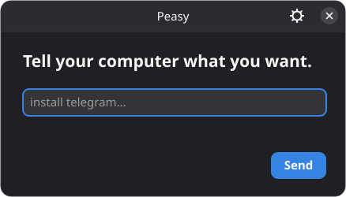

<h1>
  <a href="https://askpeasy.com">
  
  </a>
</h1>

Tell your NixOS computer what you want in plain language.

<p>
  
</p>

NixOS is one of the most powerful Linux operating systems because it is declarative and reproducible, but its configuration language can be difficult to learn. Peasy removes that complexity. Using normal language, you can install and remove packages, find AppImages, customise GNOME and Hyprland, connect Wi-Fi and Bluetooth, and prepare calendar events.

Peasy uses an OpenAI model or a local Ollama model to understand the request.
The model cannot run commands or edit files: it returns a typed action that
Peasy validates and applies through NixOS.

And because NixOS has excellent rollback support, if anything goes wrong, you can easily restore the system to a previous working state.

## Install on NixOS

> Install NixOS the Linux distribution https://nixos.org/download

Clone Peasy beside your NixOS configuration:

```console
sudo git clone https://github.com/lnbits/peasy /etc/nixos/peasy
```

Add `lib`, the Peasy module, and the optional managed file to
`/etc/nixos/configuration.nix`:

```nix
{ config, pkgs, lib, ... }:

{
  imports = [
    ./hardware-configuration.nix
    ./peasy/nix/module.nix
  ] ++ lib.optional
    (builtins.pathExists ./.peasy/peasy-managed.nix)
    ./.peasy/peasy-managed.nix;

  services.peasy.enable = true;
}
```

Rebuild, then log out and back in so the desktop launcher is loaded:

```console
sudo nixos-rebuild switch --no-flake
sudo systemctl restart peasy-system
```

Open the mint circle in the GNOME panel or Hyprland tray. On first use, choose
OpenAI or Ollama from the settings screen.

See the [installation guide](docs/install.md) for flake hosts, development
checkouts, headless systems, upgrades, and local Ollama setup.

## Use

Use the desktop application or the `peasy` command:

```console
peasy "install telegram"
peasy "install the AppImage from owner/project on GitHub"
peasy "change to a blue dark theme"
peasy "connect to my headphones"
peasy "set a meeting for 10am tomorrow"
```

Peasy owns only `.peasy/peasy-managed.nix` beside the host configuration.
Packages and settings applied through Peasy therefore participate in normal
NixOS builds and generations; `/run/peasy` contains temporary runtime data
only.

## Build

```console
nix build
```

For development:

```console
nix develop
cargo test --workspace --exclude peasy-engine
cargo build -p peasy-engine --target wasm32-unknown-unknown
```

More detail is available in the [architecture](docs/architecture.md) and
[security model](docs/security.md).

## License

MIT
