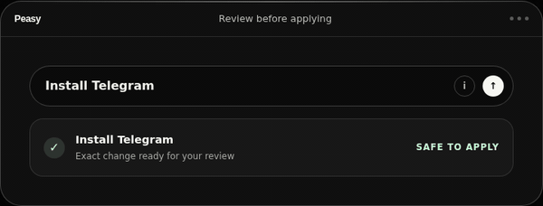

<h1>
  <a href="https://askpeasy.com">
  
  </a>
  <small><i>(beta)</i>
</h1>

Tell your NixOS computer what you want in plain language.

<p>
  
</p>

NixOS is one of the most powerful Linux operating systems because it is declarative and reproducible, but its configuration language can be difficult to learn. Peasy removes that complexity. Using normal language, you can install and remove packages, find AppImages, customise supported desktop settings, connect Wi-Fi and Bluetooth, and prepare calendar events.

Peasy uses an OpenAI model or a local Ollama model to understand the request.
The model cannot run commands or edit files: it returns a typed action that
Peasy validates and applies through NixOS.

And because NixOS has excellent rollback support, if anything goes wrong, you can easily restore the system to a previous working state.

## Install NixOS with Peasy

GNOME and KDE Plasma ISO build targets include Peasy, the bundled wallpaper and
green accent. A narrow integration with the upstream NixOS graphical installer
adds Peasy's local Nix module and bundled source to the installed system, while
preserving the normal installer screens, partitioning and account setup.

Tag releases automatically publish both installers after CI and upload verification.
Large images download as verified parts that must be reassembled before flashing.
Installed-disk boot is verified in GNOME/BIOS and Plasma/UEFI VMs; physical-hardware
testing remains important. See [ISO downloads, installation and validation](docs/iso.md).
Installing Peasy on an existing NixOS system remains supported independently below.

## Install on existing NixOS

> Install NixOS the Linux distribution https://nixos.org/download

Clone Peasy beside your NixOS configuration:

```console
sudo git clone https://github.com/lnbits/peasy /etc/nixos/peasy
```

Add `lib`, the Peasy module, and the optional managed file to
`/etc/nixos/configuration.nix`:

```nix
{ config, pkgs, lib, ... }:

{
  imports = [
    ./hardware-configuration.nix
    ./peasy/nix/module.nix
  ] ++ lib.optional
    (builtins.pathExists ./.peasy/peasy-managed.nix)
    ./.peasy/peasy-managed.nix;

  services.peasy.enable = true;
}
```

Rebuild, then log out and back in so the desktop launcher is loaded:

```console
sudo nixos-rebuild switch --no-flake
sudo systemctl restart peasy-system
```

Open the mint circle in your desktop's StatusNotifier tray, or launch Peasy from
the application menu. On first use, choose
OpenAI or Ollama from the settings screen.

See the [installation guide](docs/install.md) for flake hosts, development
checkouts, headless systems, upgrades, and local Ollama setup.

## Desktop compatibility

Peasy's core and iCalendar/default-application flow are desktop-independent.
Its single StatusNotifierItem tray works with compatible hosts: Plasma provides
one, GNOME uses AppIndicator compatibility, and Hyprland needs a bar with a tray.
GNOME and Plasma support green/other accent colours and light/dark modes; GNOME
also supports its system-default mode. Hyprland retains its separate bounded live
controls. XFCE, LXQt and unknown desktops do not have appearance adapters yet.
AI-requested wallpaper changes are not supported; ISO branding is fixed build-time
configuration. See the [capability matrix and audit](docs/desktop-compatibility.md).

## Security

See the [visual workflow and AI access map](docs/workflow-map.md) for how the
AI, Wasm policy, administrator authorization and NixOS fit together.

Peasy does not give the AI a terminal or arbitrary system access. Model output
must pass a closed, typed policy running in zero-import Wasm with no WASI and
strict memory, fuel, and output limits. The privileged service uses fixed
executables and arguments—never a shell—and runs with hidden home directories,
no Internet or device access, and only its runtime and managed configuration
directories writable. Building is kept separate from activation: a small root
helper accepts only a private, root-owned request naming a validated Nix store
generation. See the full [security model](docs/security.md).

System changes require administrator authentication after review. External
AppImages show their GitHub repository, release, download URL and pinned hash
for review; they are third-party software, not verified safe by Peasy. An optional
hash allowlist is available in `services.peasy.appImages.trustedHashes`. Enter
passwords only in the separate local password field, not in an AI request.

## Use

Use the desktop application or the `peasy` command:

```console
peasy "install telegram"
peasy "install the AppImage from owner/project on GitHub"
peasy "change to a blue dark theme"
peasy "connect to my headphones"
peasy "set a meeting for 10am tomorrow"
```

Peasy owns only `.peasy/peasy-managed.nix` beside the host configuration.
Packages and settings applied through Peasy therefore participate in normal
NixOS builds and generations; `/run/peasy` contains temporary runtime data
only.

## Build

```console
nix build
```

For development:

```console
nix develop
cargo test --workspace --exclude peasy-engine
cargo build -p peasy-engine --target wasm32-unknown-unknown
```

More detail is available in the [architecture](docs/architecture.md) and
[security model](docs/security.md).

Before a release, run `bash scripts/check-release.sh` on a Linux host with KVM.
It checks formatting, strict Clippy, tests, current dependency advisories, both
packages, the headless closure, Wasm imports, and the NixOS VM regressions.

## License

MIT
