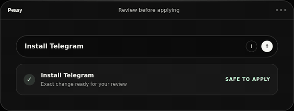

<h1>
  <a href="https://askpeasy.com">
  
  </a>
</h1>


Tell your NixOS computer what you want in plain language.

<p>
  
</p>

Peasy uses OpenAI or local Ollama to propose package, system and desktop changes.
The model selects structured operations. Peasy validates them, presents a review
and applies the approved changes.

Peasy also supports follow-up chat, text and image attachments, read-only computer
diagnosis, and opening installed applications. OpenAI adds web research; unsupported
requests explain the selected model’s limits. See [conversation and tasks](docs/chat.md).

## Contract

- System changes require review and administrator authentication. Peasy generates
  `.peasy/peasy-managed.nix`, builds the host configuration, verifies the result
  and activates it through a separate privileged helper.
- Peasy preserves administrator configuration and tracks its own contributions.
  Removing a setup retains shared dependencies and user data.
- Wi-Fi, Bluetooth, calendar and compositor actions use reviewed local operations.
  Their persistence is controlled by the receiving service, not NixOS generations.
- Closing Peasy cancels pending requests and builds. Activation and local actions
  already being applied finish; closing the window does not undo them.
- NixOS rollback restores system configuration. Personal files, database writes
  and other service data require separate recovery or backups.

The model has no terminal, arbitrary file writer or Nix-code execution interface.
Native validation, bounded Wasm policy, daemon authorization and fixed rendering
provide separate checks. See [architecture](docs/architecture.md),
[security](docs/security.md) and the [workflow map](docs/workflow-map.md).

## Install

For a new machine, use the GNOME ISO linked from the latest
[GitHub release](https://github.com/lnbits/peasy/releases/latest). Verify the attached
SHA-256 checksum. GNOME is the default; optional XFCE installation requires Internet.
See [ISO installation and validation](docs/iso.md).

For an existing NixOS system, clone beside the host configuration:

```console
sudo git clone https://github.com/lnbits/peasy /etc/nixos/peasy
```

Add the following imports and option to `configuration.nix`, retaining existing
imports and settings and adding `lib` to its function arguments:

```nix
{ config, pkgs, lib, ... }:
{
  imports = [
    ./hardware-configuration.nix
    ./peasy/nix/module.nix
  ] ++ lib.optional
    (builtins.pathExists ./.peasy/peasy-managed.nix)
    ./.peasy/peasy-managed.nix;

  services.peasy.enable = true;
}
```

```console
sudo nixos-rebuild switch --no-flake
sudo systemctl restart peasy-system
```

Log out and back in, then open Peasy from the application menu or tray. Choose
OpenAI or Ollama in Settings. The user must belong to `wheel` for system changes.
See [installation](docs/install.md) for flakes, headless use and provider setup.
The desktop follows the OS language, with ten bundled languages and English
fallback. See [localisation](docs/localisation.md) to add a translation.

Enabling Peasy desktop does not enable NetworkManager or Bluetooth. Configure
`networking.networkmanager.enable` and `hardware.bluetooth.enable` explicitly
when wanted. Peasy ISO installations default both on. A reviewed persistent
NetworkManager profile also declares its NetworkManager dependency.

## Use and capabilities

```console
peasy "install telegram"
peasy "install a video editor"
peasy "install the AppImage from owner/project on GitHub"
peasy "change to a blue dark theme"
peasy "connect to my headphones"
peasy "set a meeting for 10am tomorrow"
```

[Peas](peapod/README.md) describe domains and compose the host's supported operations.
Downloaded peas are versioned data packages; new native operations require a host
update. The LLM chooses combinations, while the host enforces the current schema
and permissions. Arbitrary NixOS options are not currently supported.

[Resource peas](docs/resources.md) add diagnostics, services, removable storage,
Nix maintenance, users, firewall, printing, displays, audio, power and applications. Their
contracts distinguish live effects from persistent NixOS configuration.

GNOME and Plasma have appearance adapters. Hyprland has bounded live controls.
Other desktops can use core features but have no appearance adapter. The tray
requires a StatusNotifier host; the application menu remains available without one.
See [desktop compatibility](docs/desktop-compatibility.md).

External AppImages show their repository, release, URL and hash for review.
The hash pins content; it does not establish that software is safe. Enter secrets
only in separate local fields, never in an AI request.

## Updates and backups

Settings provides reviewed [Peasy updates](docs/updates.md) and
[backup export/restore](docs/backups.md). Portable restore preserves destination
hardware configuration. Service setups, network profiles and AppImages require
separate destination review. Personal files and databases are not backed up.

## Development

```console
nix build
nix develop --command bash scripts/check-rust.sh
```

Follow the [pea contract](peapod/README.md) when extending capabilities. Before a
release, run `bash scripts/check-release.sh` on Linux with KVM; see
[release validation](docs/release-validation.md).

## License

MIT
