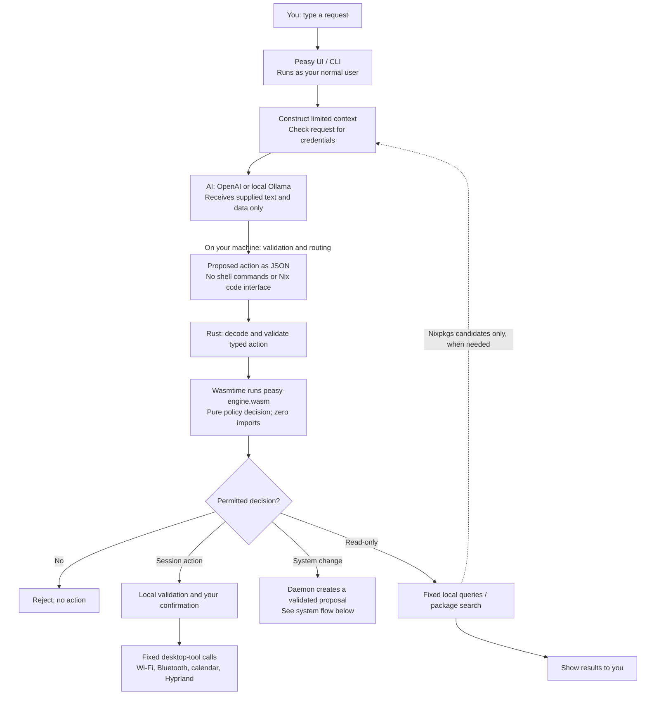
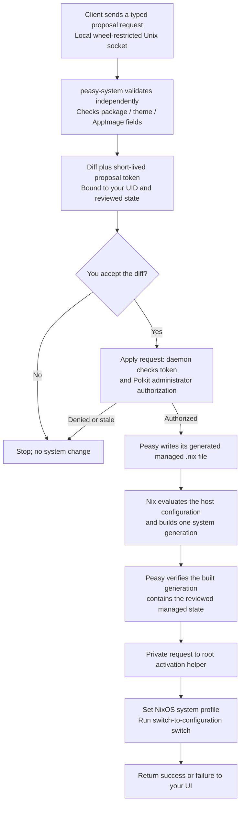

# How Peasy, AI, Wasm and NixOS fit together

**The AI suggests an action. Peasy validates it. You approve changes. Native
Peasy code, not the AI and not Wasm, performs the permitted operation.**

The diagrams use Mermaid, which GitHub renders directly in Markdown. Arrows
show data or control flow, not unrestricted access between components.

## The big picture

The AI does **not** run inside Wasm. Wasm is a small, local policy program that
checks the proposed action against supplied data. For example, a package install
must select a supplied candidate, and removal must select a Peasy-managed app.
Rust validates the action's fields as well; the privileged daemon independently
validates system requests. Wasm is not the only security boundary.

## What the AI can actually see

| Data or capability | AI access through Peasy |
|---|---|
| Your request | Yes, after credential checks. Anything you type can disclose information. |
| System summary | NixOS version, architecture, desktop type/version where available, Peasy variant, a bounded list of installed system-package names, and whether Hyprland is running. |
| Peasy-managed configuration | A canonical generated representation of Peasy's managed packages, AppImages and theme, including stored AppImage source metadata. Not the whole host configuration. |
| Conversation context | Current local time, a recent validated package, and limited validation feedback when retrying an invalid action. |
| Package search results | Selected Nixpkgs candidate attributes, names, versions and descriptions when resolving a package request. |
| Home files, documents, arbitrary Nix files, environment variables | No browsing or file-reading interface is exposed to the AI. |
| Terminal, arbitrary commands, arbitrary Nix expressions | No execution interface is exposed to the AI. |
| Wi-Fi scans and live desktop-query results | Displayed locally; not automatically fed back into the model. Information you include in your prompt is still sent. |
| API key, administrator password, separate Wi-Fi password field | Not included in model context. See the separate credential paths below. |

With OpenAI selected, the supplied context leaves your machine for the provider.
With local Ollama selected, Peasy sends it to a loopback endpoint. This describes
Peasy's request boundary, not a guarantee about a provider's internal handling.

## How an approved change reaches NixOS

This path handles package/AppImage install or removal and saved desktop appearance.
Trusted adapters apply only closed colour/mode values to GNOME or Plasma;
capabilities vary by desktop. ISO wallpaper defaults are separate build-time
configuration, not an AI wallpaper/file-editing capability.

The AI has no connection to the privileged socket or activation helper. The
client uses a closed IPC protocol; there is no generic execute-command method.
The daemon does not assume that a client ran Wasm or displayed a confirmation:
its own validation, token checks and administrator authorization are required.

The default source file is `/etc/nixos/.peasy/peasy-managed.nix`, imported by
your host configuration. Peasy generates its contents from validated data and
escapes Nix interpolation—it does not paste AI-written Nix into your system.
Nix still reads and evaluates the trusted host configuration locally.

On build failure, Peasy restores the previous managed source. Activation can
partially apply before failing, as with an ordinary NixOS switch. Generations
carry managed-state metadata; Peasy's activation integration reconciles that
state into its managed file when switching generations. This does **not** rewind
your administrator-written `configuration.nix` or other source files.

## Where credentials go

- **OpenAI API key:** the user client reads its private key file and uses the
  key in the provider request's authentication header. It is not prompt text,
  Wasm input, or a message to `peasy-system`. The provider necessarily receives
  the credential for authentication.
- **Administrator password:** entered in the system/terminal authentication
  agent and handled by Polkit's authentication stack, not the AI chat.
- **Wi-Fi password:** collected in the separate local field and passed to
  NetworkManager via the fixed `nmcli` process's stdin, not the model or Wasm.

Credential-looking prompts are rejected, but no natural-language check can
recognize every possible secret. Do not paste secrets into chat. A compromised
process running as your user, or root, remains able to access your user's secrets.

## AppImages: reviewing a source is not certifying it

For an AppImage request, the AI can suggest a repository/search. The native
client queries GitHub's release API, validates compatible release assets, and
shows the repository and release for selection. It then downloads the selected
asset through Nix to calculate a hash; discovery does not execute the AppImage.

The system proposal shows the repository, release, download URL, asset, size,
hash and generated diff. By default, your review plus administrator authorization
permits installation. An optional administrator hash allowlist can restrict it.
The fixed hash pins the downloaded bytes; it does **not** prove they are safe.

**Installed applications are not enclosed in Peasy's Wasm sandbox.** They run
with the permissions their runtime provides, normally your user's permissions.

## What Wasm protects—and what it does not

`peasy-engine.wasm` has zero imports: no WASI, filesystem, network, environment,
clock, process functions or privileged socket. The host supplies serialized data
and reads a serialized decision. Wasmtime limits memory to 16 MiB, execution to
2,000,000 fuel units, and returned data to 64 KiB.

Those limits apply to the policy program, **not** the entire Peasy application,
the AI provider, Nix builds or installed software. The native client has normal
user permissions; the daemon is a hardened root service, and its separate root
helper intentionally has the privileges required to activate a NixOS generation.
Trusted native code, Nixpkgs/host configuration, Nix, systemd and Polkit remain
part of the security boundary. This map describes the design, not a claim that
bugs or malicious third-party software are impossible.

## Follow the implementation

- [Model context, provider requests and local actions](../crates/peasy-client/src/lib.rs)
- [Typed actions and Nix rendering](../crates/peasy-core/src/lib.rs)
- [Wasm policy](../crates/peasy-engine/src/lib.rs) and [Wasmtime limits](../crates/peasy-engine-host/src/lib.rs)
- [System IPC and tokens](../crates/peasy-system/src/server.rs), [administrator authorization](../crates/peasy-system/src/authorization.rs)
- [Nix build flow](../crates/peasy-system/src/nix_backend.rs), [activation helper](../crates/peasy-system/src/activation.rs)
- [NixOS service hardening](../nix/module.nix), [full security model](security.md), [architecture details](architecture.md)
