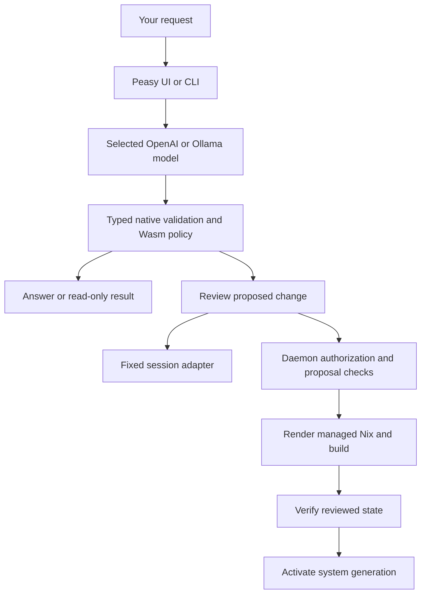

# Request flow

```mermaid
flowchart TD
    User[Your request] --> Client[Peasy UI or CLI]
    Client --> Model[Selected OpenAI or Ollama model]
    Model --> Validate[Typed native validation and Wasm policy]
    Validate --> Answer[Answer or read-only result]
    Validate --> Review[Review proposed change]
    Review --> Session[Fixed session adapter]
    Review --> Auth[Daemon authorization and proposal checks]
    Auth --> Build[Render managed Nix and build]
    Build --> Verify[Verify reviewed state]
    Verify --> Activate[Activate system generation]
```

The model cannot execute commands or apply proposals. Wasm runs local policy,
not the model. Explicit app launches use discovered desktop entries.

System changes preserve host configuration and use NixOS generations. Session
changes use their service's own persistence. Neither restores personal data.

[Architecture](architecture.md) · [Security](security.md) · [Pea contract](../peapod/README.md)
